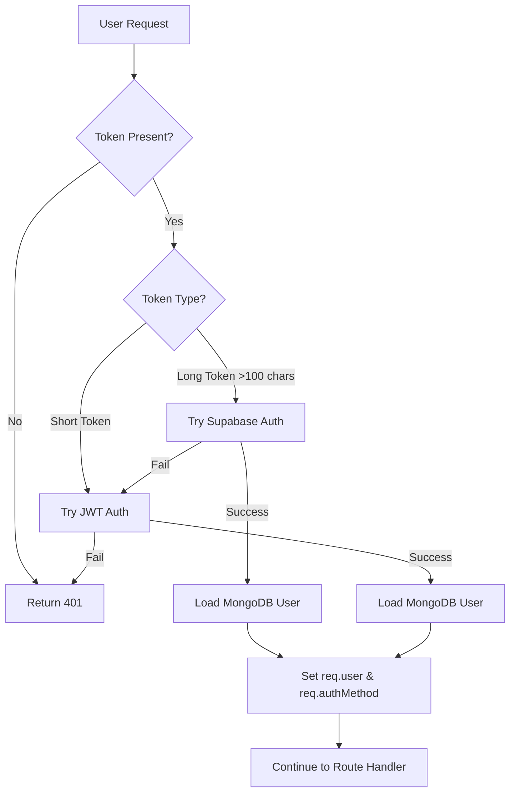

# Authentication System Migration Guide

## 🚀 Hybrid Supabase Authentication System

This document outlines the migration from the legacy JWT-only authentication system to the new hybrid Supabase authentication system.

---

## 📋 Migration Summary

### ✅ **What's New**
- **Hybrid Authentication**: Supports both Supabase and legacy JWT users
- **Seamless Migration**: Existing JWT users continue to work without interruption
- **Supabase Integration**: New users use Supabase Auth for enhanced security and features
- **Memory Efficiency**: Reduced memory usage by offloading auth processing to Supabase
- **Real-time Features**: Built-in support for Supabase real-time features

### 📂 **Files Changed**
- All route files updated to use `hybridAuth` middleware
- Legacy auth files deprecated with warnings
- New Supabase configuration added
- Hybrid authentication client for frontend

---

## 🔄 **Migration Details**

### **Route Middleware Changes**

**Before:**
```javascript
const { protect, authorize } = require('../middleware/authMiddleware');

router.get('/profile', protect, (req, res) => {
  // Route handler
});

router.post('/admin', protect, authorize(['admin']), (req, res) => {
  // Route handler
});
```

**After:**
```javascript
const { hybridProtect, requireRole } = require('../middleware/hybridAuth');

router.get('/profile', hybridProtect, (req, res) => {
  // Route handler - works with both Supabase and JWT users
});

router.post('/admin', hybridProtect, requireRole('admin'), (req, res) => {
  // Route handler
});
```

### **Frontend Authentication Changes**

**Before:**
```javascript
// Old system - JWT only
fetch('/api/v1/auth/login', {
  headers: {
    'Authorization': `Bearer ${jwtToken}`
  }
});
```

**After:**
```javascript
// New system - Hybrid with Supabase client
// Load the hybrid auth client
<script src="/hybrid-auth-client.js"></script>

// Use the global client instance
const currentUser = await window.HybridAuthClient.getCurrentUser();

// Or use with bearer token (supports both JWT and Supabase tokens)
fetch('/api/hybrid-auth/me', {
  headers: {
    'Authorization': `Bearer ${accessToken}`
  }
});
```

---

## 🏗️ **System Architecture**

### **Hybrid Authentication Flow**



### **User Migration Strategy**

1. **New Users**: Register directly with Supabase
2. **Existing JWT Users**: Continue using JWT tokens
3. **Background Migration**: JWT users automatically synced to Supabase
4. **Gradual Transition**: Users can switch to Supabase login at any time

---

## 📊 **Endpoints Reference**

### **Hybrid Auth Endpoints** (`/api/hybrid-auth`)
- `POST /register` - Register with Supabase
- `POST /login` - Login (supports email or phone)
- `POST /logout` - Logout from both systems
- `GET /me` - Get user profile
- `POST /refresh-token` - Refresh Supabase tokens
- `POST /forgot-password` - Password reset via Supabase

### **Legacy Endpoints** (Deprecated)
- `/api/v1/auth/*` - Legacy JWT endpoints (still functional)

---

## 🛠️ **Environment Variables**

### **Required for Hybrid System**
```bash
# Supabase Configuration
SUPABASE_URL=https://your-project.supabase.co
SUPABASE_ANON_KEY=eyJhbGciOiJIUzI1NiIsInR5cCI6IkpXVCJ9...
SUPABASE_SERVICE_KEY=eyJhbGciOiJIUzI1NiIsInR5cCI6IkpXVCJ9...

# Legacy JWT (Required for backward compatibility)
JWT_SECRET=your-jwt-secret-key
JWT_EXPIRES_IN=24h
```

### **Optional Configuration**
```bash
# Frontend URL for password reset redirects
CLIENT_URL=https://your-frontend.vercel.app

# Supabase Features
SUPABASE_REALTIME_ENABLED=true
```

---

## 🧪 **Testing the Migration**

### **Run Test Suite**
```bash
node scripts/test-hybrid-auth.js
```

### **Manual Testing**

1. **Test Existing JWT Users**:
   - Login with existing credentials
   - Verify JWT tokens still work
   - Check profile access

2. **Test New Supabase Users**:
   - Register new user
   - Login with Supabase credentials
   - Test token refresh

3. **Test Hybrid Middleware**:
   - Access protected routes with JWT tokens
   - Access protected routes with Supabase tokens
   - Verify role-based access control

---

## 🚨 **Breaking Changes**

### **None for End Users**
- All existing functionality continues to work
- JWT users can continue using the system normally
- No immediate action required for existing users

### **For Developers**
- Route middleware imports need updating (handled by migration script)
- New authentication client available for frontend
- Deprecated auth files will show warnings

---

## 📋 **Post-Migration Checklist**

### **Immediate (Required)**
- [x] ✅ Update all route imports to use `hybridAuth`
- [x] ✅ Verify Supabase environment variables are set
- [x] ✅ Test hybrid authentication system
- [x] ✅ Update frontend to use hybrid auth client

### **Short-term (Recommended)**
- [ ] 🔄 Update frontend registration/login forms for Supabase
- [ ] 🔄 Test user registration and login flows
- [ ] 🔄 Monitor authentication logs for issues
- [ ] 🔄 Update API documentation

### **Long-term (Optional)**
- [ ] 📈 Monitor migration of JWT users to Supabase
- [ ] 🧹 Remove legacy auth files after full migration
- [ ] 📊 Implement Supabase analytics and insights
- [ ] 🚀 Leverage additional Supabase features (real-time, edge functions)

---

## 🆘 **Troubleshooting**

### **Common Issues**

#### **"hybridProtect is not a function"**
- **Cause**: Route file not updated to import from `hybridAuth`
- **Solution**: Run `node scripts/migrate-auth-to-hybrid.js`

#### **Supabase Authentication Fails**
- **Cause**: Missing or incorrect environment variables
- **Solution**: Verify `SUPABASE_*` environment variables are set correctly

#### **JWT Users Can't Login**
- **Cause**: JWT_SECRET missing or changed
- **Solution**: Ensure JWT_SECRET matches the original secret used for existing users

#### **"Token verification failed"**
- **Cause**: Token from unsupported authentication method
- **Solution**: Verify token format and ensure user exists in MongoDB

### **Debug Mode**
```bash
# Enable debug logging
DEBUG_MODE=true
NODE_ENV=development

# Check authentication logs
tail -f logs/app.log | grep -i "auth"
```

---

## 📞 **Support**

### **Migration Assistance**
- Run the test suite: `node scripts/test-hybrid-auth.js`
- Check deprecation warnings in console output
- Review authentication logs for errors

### **Documentation**
- [Supabase Auth Documentation](https://supabase.io/docs/guides/auth)
- [Hybrid Auth Middleware](./middleware/hybridAuth.js)
- [Migration Scripts](./scripts/)

---

## 🎯 **Benefits of Migration**

### **Technical Benefits**
- **Reduced Memory Usage**: Auth processing offloaded to Supabase
- **Enhanced Security**: Industry-standard auth provider
- **Real-time Features**: Built-in Supabase real-time capabilities
- **Scalability**: Supabase handles auth scaling automatically

### **Business Benefits**
- **Improved User Experience**: Faster authentication flows
- **Reduced Maintenance**: Less authentication code to maintain
- **Feature Rich**: Email verification, password reset, 2FA support
- **Analytics**: Built-in user authentication analytics

---

**🚀 Your authentication system is now ready for production with hybrid Supabase support!**
